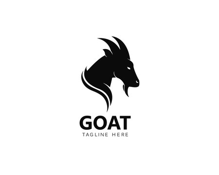
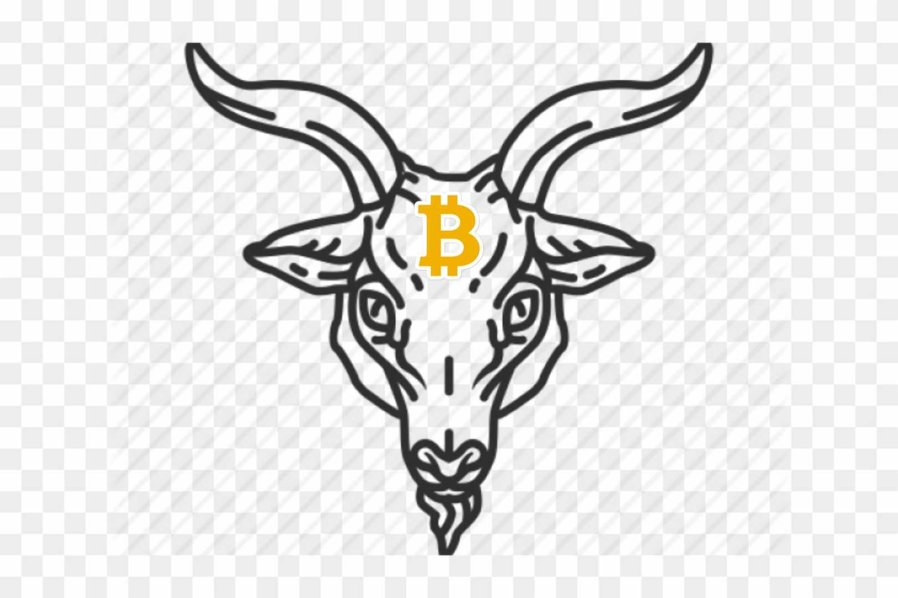
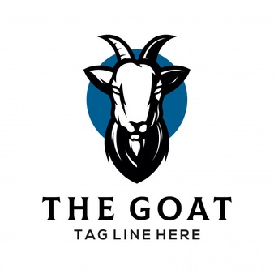
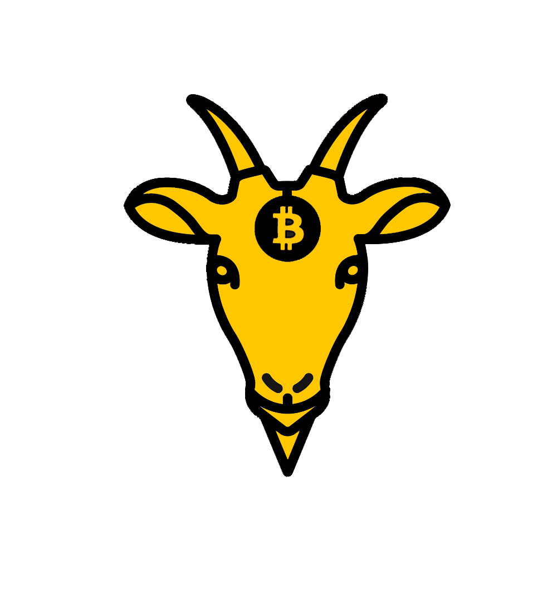
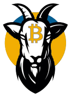
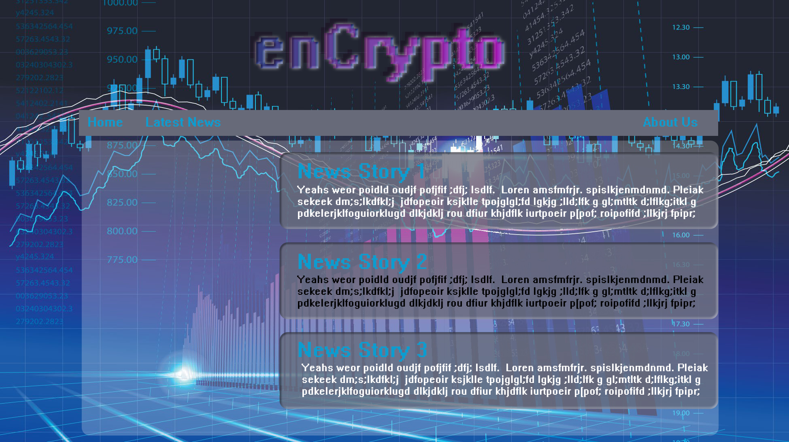
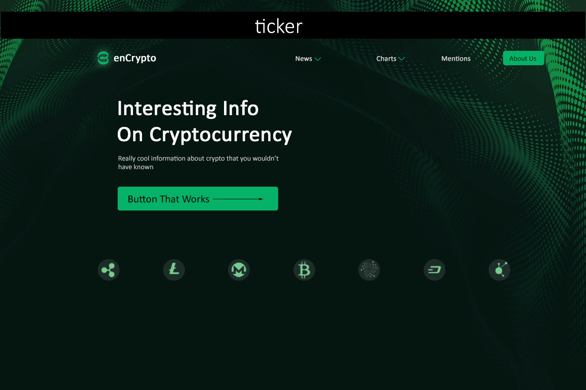
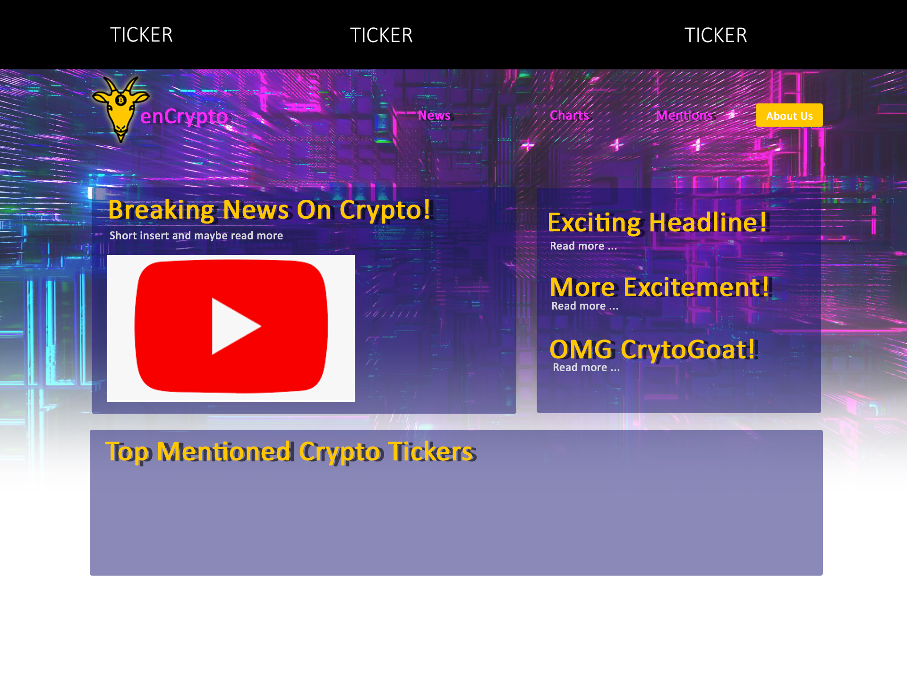

1. Purpose of the app/website that we are building
- EnCrypto is a provider of financial tech, blockchain, and crypto news. We bring you the latest information and analysis on the future of money

2. Layout and user functionality 
    done with user functionality

3. M.V.P

    *Provide the following:
    - Pull and display API data : Breaking News /done 
    - Filter by video/article / done 
    - Filter by ticker symbols and display / done 
    - Build out all pages with buttons /  done  
    - All buttons working and navigates to designated page / done 

4. Color schemes 

 - https://coolors.co/ffbf00-e83f6f-2274a5-32936f-ffffff

* Title (with link to live Demo)

* Overview (description of your app)

This site is our front end project for our cohort. Our group decided to focus on Crypto currency. With all the market swings and uptick in news coverage we figured it would be a great idea to have a one stop shop site for leading Blockchain news and education on market current conditions. With the rapid pace of growth, more and more people are interested in learning more, learning positives, learning negatives or just staying up to date with current events in this ever changing market. Encrypto is designed to give you all of this. 

* Screen Shot of App
    * 

* Tech Stack
    * Languages: CSS, JS, HTML
    * APIs: 1 from cryptonews-api.com, 1 chart widget from tradingview.com, 1 chart widget from cryptohopper.com
    * Other: AJAX, JSON, Photoshop, Postman  

* MVP
    * Provide the following
    - Pull and display API data : Breaking News /done 
    - Filter by video:  done 
    - Filter by ticker symbols and display: done 
    - Build out all pages with buttons: done  
    - All buttons working and navigates to designated page: done 
    
    

* Stretch Goals (Completed)
    - Pull and display API data : Breaking News /done 
    - Filter by video:  done 
    - Filter by ticker symbols and display: done 
    - Build out all pages with buttons: done  
    - All buttons working and navigates to designated page: done 

* Stretch Goals (Future)
    N/A

* Code Snippets (show some impressive code)
    * This is the code to fetch ticker symbol, Listening for the menu selection, Store the ticker symbol in local storage, open results page onLoad(), display results. Change color of sentiment based on the value (neutral, positive, negative)

const newsMenu = document.querySelector('.dropdown-menu');
const sentimentMenu = document.querySelector('.sentiment-menu');
newsMenu.addEventListener("click", e => {
    e.preventDefault();
    if(e.target.id === "BTC" || e.target.id === "ETH" || e.target.id ==="XRP"){
        localStorage.symbol = e.target.id; 
        window.location.href = "results.html"
    }
})
function displaySymbol(){
    
    let symbol = localStorage.symbol;
    // if(localStorage.symbol == undefined || localStorage == null ? "BTC" : localStorage.symbol)
    let urlSymbol = `https://cryptonews-api.com/api/v1?tickers=${symbol}&items=50&token=${APIKEY}`;

    fetch(urlSymbol)
    .then(apiData1 => apiData1.json())
    .then(symbolData => {

        symbolArray = symbolData;
        // console.log(`This is symbolArray`);
        // console.log(symbolArray.data.length);
        
        let fontColorTitle = "";
        let fontColor = "";
        let fontSize = "18px";
        let fontSize1 = "18px";
        let count = 0;

        while(count < symbolArray.data.length){
            let sentimentColor = "goldenrod"
            if(symbolArray.data[count].sentiment == "Positive"){
                sentimentColor = "dodgerblue";
            }
            else if(symbolArray.data[count].sentiment == "Negative"){
                sentimentColor = "red";
            }

* Screenshots Our App

    *  planning phase for site layout 
    * 
    * 
    * 
    * 

* Logo Drafts

    * 
    * 
    * 
    * 
    * 

* Site Layout 

    * 
    * 
    * 
    * 

* Developer Team
    * Andrena Alexandre
    * https://github.com/AndrenaAlexandre
    * Design, User Functionality & UX, UI
    * Css, Js, Html, Photoshop
    
    * Jose Tollinchi
    * https://github.com/AnaIitico
    * Api, JavaScript Integration & UX, UI
    * Css, Js, Html, Postman
    
    * Mike Williams
    * https://github.com/mikej803
    * Api, JavaScript Integration & UX, UI
    * Css, Js, Html, Postman
    
    * Brandon Stinson
    * https://github.com/Bxpnds
    * Design, User functionality, Quality Assurance & UX, UI
    * Css, Js, Html,

* Resources

    * Api & Widget Sites
    - Api website
    - https://cryptonews-api.com/documentation

    - Widget Website
    - https://www.cryptohopper.com/website-widgets?widget=label

    * STEM Color Theme
    - color Theme pulled from here 
    - https://coolors.co/palettes/trending
    
    * Responsiveness Resources
    - https://www.w3schools.com/html/html_responsive.asp

- Facebook link: https://www.facebook.com/EnCrypto-News-111987951063569
- Twitter link: https://twitter.com/EncryptoNews
- Instagram link: https://www.instagram.com/encryptonews/